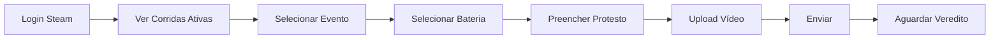
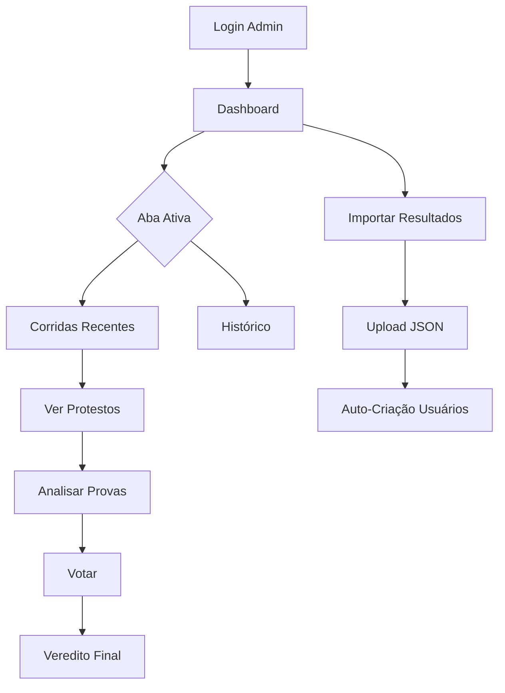

# 🏎️ GAV Protestos

### Sistema Profissional de Gestão de Incidentes para SimRacing


**Plataforma Mobile-First para gestão profissional de protestos de SimRacing, integrada via Steam e Assetto Corsa JSONs.**

Desenvolvido para a liga [**Guerreiros do AV**](https://www.instagram.com/guerreirosdoav/) 🏁

---

## 📋 Índice

- [Tech Stack](#-tech-stack)
- [Funcionalidades](#-funcionalidades-chave)
- [Workflows](#-fluxos-de-usuário)
- [Instalação](#-instalação--dev-setup)
- [Roadmap](#-roadmap)

---

## 🛠️ Tech Stack

### Frontend
| Tecnologia | Versão | Uso |
|------------|--------|-----|
|  | 18.x | UI Framework |
|  | 5.x | Type Safety |
|  | 7.x | Build Tool |
|  | 6.x | Component Library |

### Backend (Serverless)
| Tecnologia | Uso |
|------------|-----|
|  | Database |
|  | Authentication |
|  | Video Upload |
|  | Backend Logic |

### Autenticação
- **Steam OpenID** - Custom Token Flow (Anti-Fraude via SteamID64)

### Deploy & CI/CD
| Plataforma | Uso |
|------------|-----|
|  | Hosting & CI/CD |
|  | Version Control |

---

## ✨ Funcionalidades Chave

### 🔐 Autenticação Segura
- **Login exclusivo via Steam** - Zero possibilidade de fraude ou spoofing
- Integração direta com SteamID64 para identificação única de pilotos
- Sistema de roles: `Driver`, `Admin`, `Super Admin`

### 📱 Mobile-First Experience
- Design responsivo otimizado para celular (App-like)
- PWA-Ready com experiência nativa
- Interface limpa com componentes Material Design

### 🏎️ Importação Inteligente de Resultados
- **Drag & Drop** de JSONs do Assetto Corsa
- ID Determinístico `timestamp_track_type` - **Zero duplicatas**
- Auto-criação/atualização de usuários (Upsert)
- Parsing automático: pilotos, tempos, posições, tipo de sessão

### ⏱️ Two-Step Selection (Evento → Sessão)
- **Passo 1**: Escolha o Evento (ex: "Etapa 5 - Áustria")
- **Passo 2**: Escolha a Sessão:
  - `BATERIA ÚNICA - 20:00` (se 1 corrida)
  - `BATERIA 1 - 20:00`, `BATERIA 2 - 21:00` (se múltiplas)
  - `[CLASSIFICAÇÃO] - 19:30`
- Nomenclatura dinâmica automática baseada no contexto

### 🚨 Gestão de Protestos
- **Janela de 24h** para envio de protestos (bloqueio automático após deadline)
- Tipos de incidentes padronizados:
  - Colisão Evitável
  - Retorno Perigoso à Pista
  - Divebomb
  - Blocking
  - Ignorar Bandeira Azul
  - Track Limits
  - E mais...
- Upload de **evidências em vídeo** (MP4, MKV, AVI, WMV)
- Campo "Posições Perdidas" para quantificar gravidade

### ⚖️ Sistema de Votação (Comissários)
- Dashboard com abas: **Ativas** vs **Histórico**
- Visualização completa de evidências
- Votação democrática: Punir / Absolver
- Timeline de atividades e decisões

### 🎯 Diferenciais Técnicos
- **Filtro inteligente de 24h** - Dropdown mostra apenas corridas ativas
- **Nomenclatura PT-BR pura** - Interface 100% em português
- **Ellipsis Mobile** - Textos longos não quebram layout
- **Fallback robusto** - Tratamento de tipos undefined

---

## 🔄 Fluxos de Usuário

### 👤 Para o Piloto (Driver)



1. **🔑 Login Seguro**
   - Redirecionamento para Steam OpenID
   - Autenticação via SteamID64
   - Criação automática de perfil

2. **⏰ Janela de Protesto**
   - Ver apenas corridas dentro de 24h
   - Alert visual quando não há eventos
   - Formulário desabilitado após deadline

3. **📝 Envio de Protesto**
   - Seleção two-step (Evento → Sessão)
   - Escolha do piloto acusado
   - Tipo de incidente (9 opções)
   - Upload de provas (até 3 vídeos)
   - Descrição detalhada

4. **📊 Acompanhamento**
   - Status: Pendente / Julgado
   - Veredito: Punido / Absolvido
   - Transparência total

---

### 👨‍⚖️ Para o Admin (Comissário)



1. **📊 Dashboard Funcional**
   - Abas separadas: **Ativas** vs **Histórico**
   - Paginação (10 itens/página)
   - Busca por nome de evento/pista
   - Badges de status (Prazo Aberto, Pendentes, Julgados)

2. **⚖️ Sistema de Votação**
   - Visualização completa do incidente
   - Provas em vídeo incorporadas
   - Votação: Punir / Absolver
   - Registro de histórico de votos

3. **📥 Importação de Resultados**
   - Drag & Drop de JSON do Assetto Corsa
   - **ID Determinístico** previne duplicatas
   - Parsing automático:
     - Evento, Pista, Data, Tipo
     - Lista de pilotos com SteamID
   - Upsert de usuários:
     - Novos → Criados automaticamente
     - Existentes → Nome atualizado (se mudou)

4. **🎨 Badges de Tipo**
   - 🔴 **CORRIDA** (vermelho)
   - 🟣 **CLASSIFICAÇÃO** (roxo)
   - ⚪ **TREINO** (cinza)

---

### 🔒 Roles e Permissões

| Role | Acesso |
|------|--------|
| **Driver** | Criar protestos, visualizar próprios protestos |
| **Admin** | Dashboard, votação, importação de resultados |
| **Super Admin** | Ferramentas avançadas de gestão* |

> *Funcionalidades de Super Admin são discretas e não listadas publicamente

---

## 🚀 Instalação & Dev Setup

### Pré-requisitos
- Node.js 18+
- npm 9+
- Conta Firebase (Blaze Plan recomendado)
- Steam API Key

### Setup Local

```bash
# 1. Clone o repositório
git clone https://github.com/seu-user/gav-protestos.git
cd gav-protestos

# 2. Instale as dependências
npm install

# 3. Configure as variáveis de ambiente
cp .env.example .env
```

### Configuração do `.env`

```env
# Firebase Configuration
VITE_FIREBASE_API_KEY=your_firebase_api_key
VITE_FIREBASE_AUTH_DOMAIN=your-project.firebaseapp.com
VITE_FIREBASE_PROJECT_ID=your-project-id
VITE_FIREBASE_STORAGE_BUCKET=your-project.appspot.com
VITE_FIREBASE_MESSAGING_SENDER_ID=123456789
VITE_FIREBASE_APP_ID=1:123456789:web:abcdef

# Steam API
VITE_STEAM_API_KEY=your_steam_api_key
VITE_STEAM_RETURN_URL=http://localhost:5173/auth/callback
```

> 📝 **Nota**: Obtenha sua Steam API Key em: https://steamcommunity.com/dev/apikey

### Executar Localmente

```bash
# Dev Server (Hot Reload)
npm run dev

# Build de Produção
npm run build

# Preview da Build
npm run preview
```

Acesse: `http://localhost:5173` 🏁

---

## 🎯 Roadmap

### 🚧 Em Desenvolvimento

- [ ] **Notificações Push** - Alertas de novos protestos e vereditos
- [ ] **Ranking de Fair Play** - Sistema de pontos na carteira
- [ ] **Histórico de Penalidades** - Perfil público do piloto
- [ ] **Exportação de Relatórios** - PDF com resumo da etapa

### 💡 Backlog

- [ ] **Integração iRacing** - Parser para JSONs do iRacing
- [ ] **Dashboard de Estatísticas** - Gráficos de incidentes por tipo
- [ ] **Sistema de Appeals** - Recurso contra decisões
- [ ] **Multi-idioma** - Inglês + Espanhol

---

## 📸 Screenshots

> 🚧 Em breve: Screenshots do sistema em ação

---

## 🤝 Contribuindo

Este projeto é **proprietário** e desenvolvido exclusivamente para a liga Guerreiros do AV.

Para sugestões ou bugs, entre em contato com a administração da liga.

---

## 📜 Licença

**Proprietary License** - © 2024 Guerreiros do AV

Todos os direitos reservados. Uso não autorizado é proibido.

---

## 🏆 Créditos

Desenvolvido com ☕ e 💜 por Daniel Buck.

**Liga**: [Guerreiros do AV](https://www.instagram.com/guerreirosdoav/)

---

<p align="center">
  <strong>🏁 Bandeira Verde para protestos justos e organizados! 🏁</strong>
</p>
